# Amazon Connect Decisions — Supply & Demand Plan Quick Start Guide

> Amazon Connect Decisions(ACD)에서 **Supply Plan**과 **Demand Plan**을 처음부터 성공시키기 위한 샘플 데이터 + 단계별 가이드입니다.  
> 이 레포의 샘플 데이터를 업로드하면 약 30분 내에 두 Plan을 모두 생성할 수 있습니다.

---

## 목차

1. [Amazon Connect Decisions 개요](#1-amazon-connect-decisions-개요)
2. [주요 개념 및 용어](#2-주요-개념-및-용어)
3. [샘플 데이터 구조](#3-샘플-데이터-구조)
4. [시작하기 — 인스턴스 생성 & 온보딩](#4-시작하기--인스턴스-생성--온보딩)
5. [데이터 업로드 & 매핑](#5-데이터-업로드--매핑)
6. [Demand Plan 생성](#6-demand-plan-생성)
7. [Supply Plan 생성](#7-supply-plan-생성)
8. [데이터 검증 규칙 (필독)](#8-데이터-검증-규칙-필독)
9. [자주 발생하는 에러 & 해결](#9-자주-발생하는-에러--해결)
10. [운영 가이드](#10-운영-가이드)

---

## 1. Amazon Connect Decisions 개요

**Amazon Connect Decisions**는 AWS의 AI 기반 공급망 의사결정 서비스입니다.

| 기능 | 설명 |
|------|------|
| **Demand Plan** | 과거 판매 이력을 학습하여 미래 수요를 예측 (기준 예측 → 합의 → 게시) |
| **Supply Plan** | 수요 예측을 실행 가능한 생산/조달 일정으로 변환 (제약 기반 계획) |
| **Insights** | 예외 탐지 + 근본 원인 분석 + 권장 조치 (사전 공급망 모니터링) |

Supply Plan은 자재 가용성, 리드 타임, 프로덕션 용량, 창고 공간 제한과 같은 **실제 운영 제약 조건을 준수**하므로 계획에서 실행으로 자신 있게 이동할 수 있습니다.

---

## 2. 주요 개념 및 용어

> 출처: [AWS 공식 문서 - Key Concepts and Terminology](https://docs.aws.amazon.com/ko_kr/aws-supply-chain/latest/userguide/key-concepts-and-terminology.html)

### Insights 관련

| 용어 | 정의 |
|------|------|
| **인사이트 (Insights)** | 예외 탐지 + 근본 원인 분석 + 권장 조치를 결합한 사전 공급망 모니터링 리소스 |
| **예외 (Exception)** | 공급망 성능이 정의된 임계값을 위반할 때 생성되는 알림 |
| **지표 (Metric)** | 공급망 성과를 평가하는 정량화 가능한 측정치 (예: 예측 정확도, 재고 수준) |
| **규칙 (Rule)** | 예외를 생성해야 하는 시기를 정의하는 비즈니스 로직 |
| **근본 원인** | 예외가 발생한 이유를 설명하는 AI 기반 조사 |
| **권장 사항** | 예외를 해결하기 위한 AI 생성 제안 작업 |
| **에이전트 지침** | AI 에이전트의 동작을 안내하는 비즈니스 정책/운영 제약 |

### Demand Plan 관련

| 용어 | 정의 |
|------|------|
| **기준 예측 (Baseline Forecast)** | 시스템이 과거 데이터로 생성하는 초기 수요 예측 |
| **재정의 (Override)** | 시스템이 생성한 예측을 수동 수정하는 것 |
| **계획 기간 (Plan Horizon)** | 예측이 생성되는 미래까지의 총 시간 |
| **예상 세부 수준 (Forecast Granularity)** | 예측 관리 차원 조합 (제품 × 위치 × 고객 × 채널) |
| **게시 (Publish)** | 완성된 수요 계획을 다운스트림 시스템에 전달하여 확정 |

**Demand Plan 상태:**
- `보류 중` → `진행 중` → `검토 중` (편집 가능) → `최종` (편집 불가)

### Supply Plan 관련

| 용어 | 정의 |
|------|------|
| **Demand Time Fence** | 공급 계획이 예상 수요를 무시하는 기간 (확정 주문만 사용) |
| **Planning Time Fence** | 공급 계획이 동결되는 기간 (새 Planned Order 생성 안 함) |
| **Past Due Supply Days** | 납기 초과해도 유효 공급으로 인정하는 일수 |
| **Demand Netting** | 수요 소스 선택 (Forecast / Sales Order / 둘 다) |
| **Forecast Source** | External (직접 업로드) 또는 Demand Plan (시스템 생성) |

---

## 3. 샘플 데이터 구조

### 파일 위치

```
sample-data/
├── company.csv              (1 row)
├── geography.csv            (1 row)
├── product.csv              (5 rows)
├── site.csv                 (3 rows)
├── tradingpartner.csv       (3 rows)
├── vendorproduct.csv        (15 rows)
├── vendorleadtime.csv       (15 rows)
├── sourcingrules.csv        (15 rows)
├── inventorypolicy.csv      (15 rows)
├── inventorylevel.csv       (15 rows)
├── forecast.csv             (780 rows)
├── inboundorderline.csv     (15 rows)
├── outboundorderline.csv    (4,980 rows — 24개월)
├── supplementary_time_series.csv  (empty)
└── product_alternate.csv    (empty)
```

### 샘플 데이터 스펙

| 항목 | 값 |
|------|-----|
| 회사 | ACD-COMPANY (가상) |
| 제품 | 5개 — Skincare 3 + Makeup 2 |
| 사이트 | 3개 — DC 2 + Store 1 |
| 벤더 | 3개 |
| 판매 이력 | **24개월** (Demand Plan 학습용) |
| Forecast | 52주 Weekly (Supply Plan 입력) |
| 계절성 | 있음 (겨울: Skincare↑, 여름: Makeup↑) |
| 성장 트렌드 | 연 10% 성장 반영 |

### CDM 매핑 테이블

| # | 파일명 | CDM Target | 필수 | 역할 |
|---|--------|-----------|------|------|
| 1 | `company.csv` | company | ✅ | 회사 마스터 |
| 2 | `geography.csv` | geography | ✅ | 지역 정보 |
| 3 | `product.csv` | product | ✅ | 제품 마스터 |
| 4 | `site.csv` | site | ✅ | 거점 (DC/Store) |
| 5 | `tradingpartner.csv` | trading_partner | ✅ | 벤더/공급자 |
| 6 | `vendorproduct.csv` | vendor_product | ✅ | 벤더-제품 매핑 |
| 7 | `vendorleadtime.csv` | vendor_lead_time | ✅ | 벤더별 리드타임 |
| 8 | `sourcingrules.csv` | sourcing_rules | ✅ | 조달 규칙 |
| 9 | `inventorypolicy.csv` | inventory_policy | ✅ | 안전재고 정책 |
| 10 | `inventorylevel.csv` | inventory_level | ✅ | 현재 재고 스냅샷 |
| 11 | `forecast.csv` | forecast | ✅ (Supply) | 외부 수요 예측 |
| 12 | `inboundorderline.csv` | inbound_order_line | ✅ | 입고 주문 (PO) |
| 13 | `outboundorderline.csv` | outbound_order_line | ✅ | 출고 주문 (판매 이력) |
| 14 | `supplementary_time_series.csv` | supplementary_time_series | 선택 | 프로모션 등 외부 시그널 |
| 15 | `product_alternate.csv` | product_alternate | 선택 | 대체 제품 |

### 엔티티 관계도

```
company ─────┬──→ product (company_id)
             ├──→ site (company_id)
             ├──→ geography (company_id)
             └──→ tradingpartner (company_id)

product ─────┬──→ sourcingrules (product_id)
             ├──→ vendorleadtime (product_id)
             ├──→ forecast (product_id)
             ├──→ inventorylevel (product_id)
             ├──→ inboundorderline (product_id)
             └──→ outboundorderline (product_id)

site ────────┬──→ sourcingrules (to_site_id)
             ├──→ vendorleadtime (site_id)
             ├──→ inventorylevel (site_id)
             └──→ outboundorderline (ship_from_site_id)

tradingpartner ──→ sourcingrules (tpartner_id)
                 → vendorleadtime (vendor_tpartner_id)
                 → inboundorderline (tpartner_id)
```

---

## 4. 시작하기 — 인스턴스 생성 & 온보딩

### Step 1: AWS Console에서 ACD 인스턴스 생성

AWS Console → "Amazon Connect Decisions" 검색 → **Create instance**


### Step 2: 사용자 등록

인스턴스 생성 후 이메일 주소를 등록합니다. IAM Identity Center와 연동됩니다.

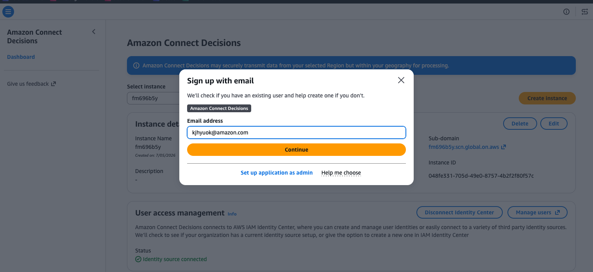

### Step 3: 온보딩 (Get Started)

ACD 앱에 처음 접속하면 4단계 온보딩 질문이 나옵니다:

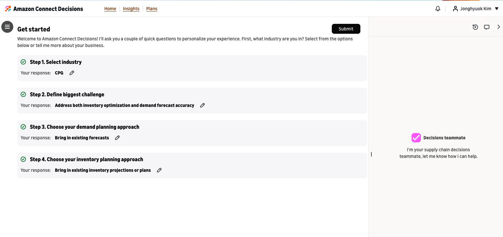

| Step | 질문 | 권장 응답 |
|------|------|---------|
| 1 | Select industry | **CPG** (또는 해당 업종) |
| 2 | Define biggest challenge | **Address both inventory optimization and demand forecast accuracy** |
| 3 | Choose demand planning approach | **Bring in existing forecasts** |
| 4 | Choose inventory planning approach | **Bring in existing inventory projections or plans** |

**Submit** → Home 대시보드로 이동합니다.

### Step 4: Home 대시보드

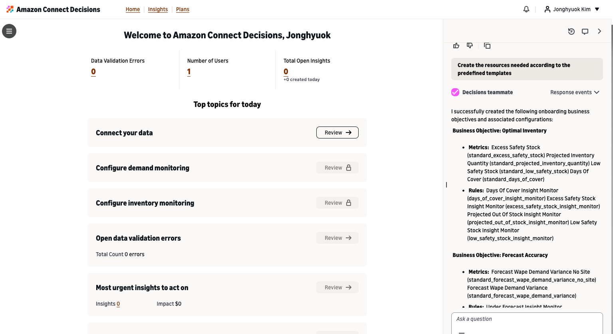

"Connect your data" → **Review** 버튼을 클릭하여 데이터 업로드를 시작합니다.

---

## 5. 데이터 업로드 & 매핑

### Step 5: CSV 파일 업로드

**Data Management → Upload Files for New Data Source**

`sample-data/` 폴더의 모든 CSV를 드래그 앤 드롭으로 한꺼번에 업로드합니다.

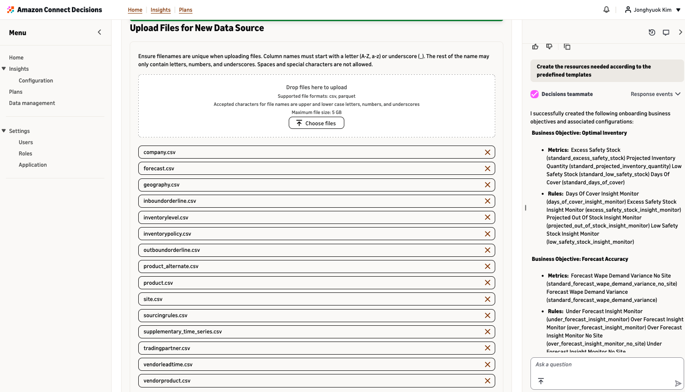

> **규칙**: 파일명은 영문(A-Z, a-z) + 숫자 + 밑줄(_)만 허용. 최대 5GB. CSV 또는 Parquet.

### Step 6: 데이터 매핑 (SQL 생성)

업로드 후 **Data Mapping** 화면에서 각 소스를 CDM 타겟 테이블에 매핑합니다.

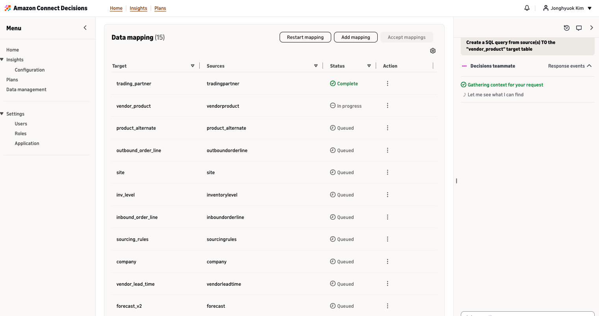

**Decisions Teammate에게 각 테이블별로 요청합니다:**

```
"Create a SQL query from source(s) TO the "sourcing_rules" target table"
"Create a SQL query from source(s) TO the "inbound_order_line" target table"
... (각 테이블 반복)
```

모든 매핑이 Complete → **Accept Mappings** 클릭

### Step 7: Data Flow 실행 확인

Accept 후 각 Destination flow가 자동 실행됩니다.

**실행 중:**
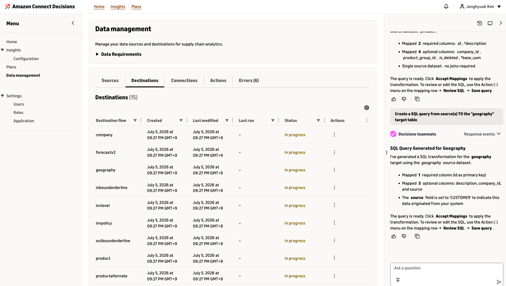

**모든 플로우 Succeeded:**
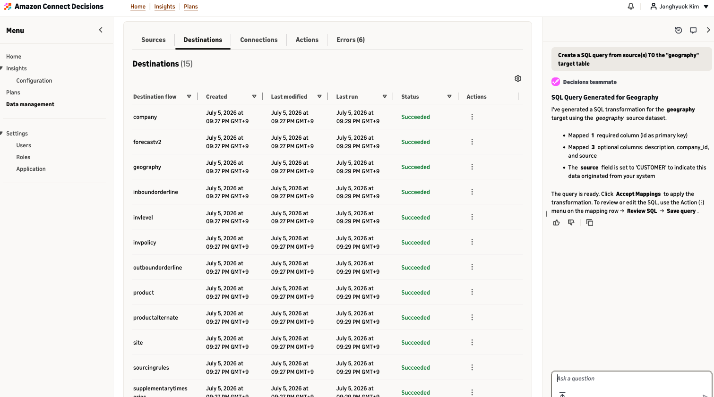

> ⚠️ **모든 플로우가 Succeeded 상태여야** Plan 생성이 가능합니다. Errors 탭을 확인하세요.

### ⚠️ 매핑 주의사항

- **소스 데이터셋을 먼저 선택**한 후 SQL 생성 (소스 없이 SQL만 넣으면 `sources=[]` 에러)
- SQL 생성 중 **페이지를 벗어나면 저장되지 않음** — 완료까지 탭 유지
- Decisions Teammate에게 한 테이블씩 순서대로 요청

---

## 6. Demand Plan 생성

### 6.1 Plan Configuration

**Plans → Demand Plan → Create Plan**

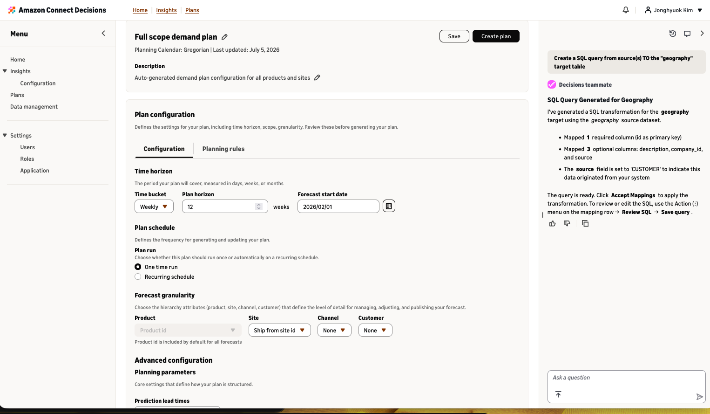

| 항목 | 설정값 | 설명 |
|------|--------|------|
| **Time bucket** | `Weekly` | 예측 단위 |
| **Plan horizon** | `12` weeks (또는 52) | 예측 기간 |
| **Forecast start date** | `2026/02/01` | 과거 날짜 → Backtest 가능 (정확도 검증) |
| **Plan run** | `One time run` | 1회 실행 |

### 6.2 Forecast Granularity

| 차원 | 설정값 | 설명 |
|------|--------|------|
| **Product** | `Product id` (기본) | 제품별 예측 |
| **Site** | ⭐ `Ship from site id` | 출하 거점별 — **반드시 선택!** |
| **Channel** | `None` | |
| **Customer** | `None` | |

> ⚠️ Site를 선택하지 않으면 product 단위로만 예측되어 Supply Plan과 연결 불가

### 6.3 Advanced Configuration

| 항목 | 설정값 | 설명 |
|------|--------|------|
| **Prediction lead times** | `3` weeks | 벤더 리드타임 고려한 예측 선행 기간 |

### 6.4 Forecast Start Date 이해

```
과거 날짜 (2026/02/01) 설정 시:
  [2026/02/01 ~ 오늘]  = Backtest 구간 (예측 vs 실제 비교 → WAPE 측정)
  [오늘 ~ +12주]        = Forecast 구간 (실제 예측)
```

### 6.5 Demand Plan 필수 데이터

| 데이터 | 최소 | 권장 | 이 샘플 |
|--------|------|------|---------|
| outboundorderline (판매 이력) | 12개월 | 24~36개월 | ✅ 24개월 |
| product | 1개+ | - | ✅ 5개 |
| site | 1개+ | - | ✅ 3개 |

### 6.6 결과 확인

**Create Plan** → 10~20분 후 결과:

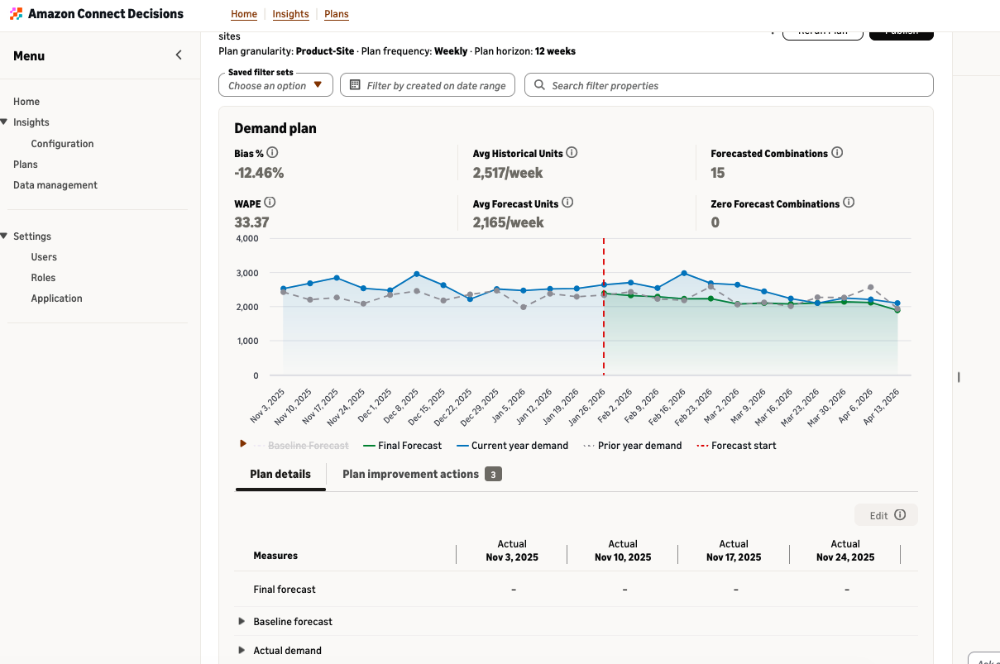

| 지표 | 의미 | 샘플 결과 |
|------|------|---------|
| **WAPE** | 가중 절대 백분율 오차 (낮을수록 좋음) | 33.37% |
| **Bias %** | 편향 (0에 가까울수록 좋음) | -12.46% |
| **Avg Historical Units** | 주간 평균 실제 판매 | 2,517/week |
| **Avg Forecast Units** | 주간 평균 예측 | 2,165/week |
| **Forecasted Combinations** | 예측 생성된 product×site 수 | 15 |

### 6.7 Publish

예측 확인 후 **Publish** 버튼 → Supply Plan의 입력으로 사용 가능

| 상태 | 의미 |
|------|------|
| In progress | 예측 생성 중 |
| In-review | 검토/편집 가능 |
| **Published** | 공식 확정 → Supply Plan 연결 가능 |
| Final | 계획 주기 종료 |

---

## 7. Supply Plan 생성

### 7.1 Plan Details

**Plans → Supply Plan → Create Plan**

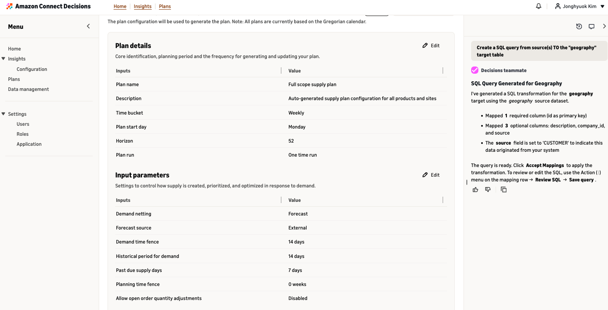

| 항목 | 설정값 | 설명 |
|------|--------|------|
| **Plan name** | `Full scope supply plan` | 플랜 이름 |
| **Time bucket** | `Weekly` | 계획 단위 |
| **Plan start day** | `Monday` | 주간 시작 요일 |
| **Horizon** | `52` weeks | 계획 기간 |
| **Plan run** | `One time run` | 1회 실행 |

### 7.2 Input Parameters

| 항목 | 설정값 | 설명 |
|------|--------|------|
| **Demand netting** | ✅ `Forecast` | 수요 소스 |
| **Forecast source** | `External` | 업로드한 forecast.csv 사용 |
| **Demand time fence** | `14` days | 14일 이내는 확정 주문만 |
| **Historical period for demand** | `14` days | 과거 수요 평균 계산 기간 |
| **Past due supply days** | `7` days | 7일 지연 PO도 유효 |
| **Planning time fence** | `0` weeks | 동결 없음 |
| **Allow open order qty adjustments** | `Disabled` | 기존 PO 변경 안 함 |

### 7.3 파라미터 동작 원리

```
┌────────────────────────────────────────────────────────────┐
│ Demand Time Fence (14일)                                    │
│ ├── 0~14일: 확정 주문(OPEN PO/SO)만 사용                     │
│ └── 14일~: Forecast 기반 수요                               │
├────────────────────────────────────────────────────────────┤
│ Planning Time Fence (0주)                                   │
│ ├── 0 = 전 기간에 새 Planned Order 생성 가능                 │
│ └── N주 = 처음 N주는 동결 (기존 주문만 유지)                 │
├────────────────────────────────────────────────────────────┤
│ Past Due Supply Days (7일)                                  │
│ └── 납기 7일 초과 PO도 아직 도착할 것으로 간주                │
└────────────────────────────────────────────────────────────┘
```

### 7.4 결과 확인

**Create supply plan** → 5~10분 후 결과:

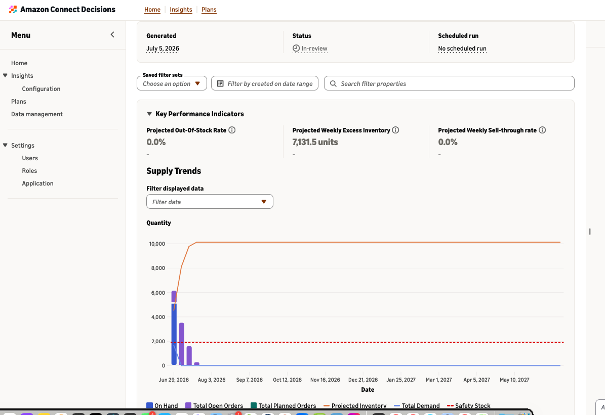

| KPI | 의미 | 샘플 결과 |
|-----|------|---------|
| **Projected Out-Of-Stock Rate** | 예상 품절률 | 0.0% |
| **Projected Weekly Excess Inventory** | 주간 초과 재고 | 7,131.5 units |
| **Projected Weekly Sell-through Rate** | 주간 판매 소진율 | 0.0% |

Supply Trends 차트에서 On Hand, Open Orders, Planned Orders, Projected Inventory, Total Demand, Safety Stock을 시각적으로 확인할 수 있습니다.

---

## 8. 데이터 검증 규칙 (필독)

이 규칙을 위반하면 Plan 생성이 **Failed**됩니다.

### 8.1 Sourcing Rules

| 규칙 | 설명 |
|------|------|
| ✅ `sourcing_ratio` 합계 = 100% | 동일 (product_id + to_site_id) 조합의 비율 합 = 100 |
| ✅ 중복 없음 | (product_id + to_site_id + tpartner_id) 유일 |
| ✅ `sourcing_rule_type` | `buy`, `transfer`, `manufacture` |
| ✅ VLT 매칭 | 모든 (product_id, tpartner_id)에 vendorleadtime 존재 |

### 8.2 Inventory

| 규칙 | 설명 |
|------|------|
| ✅ `on_hand_inventory` >= 0 | 음수 불가 |
| ✅ `ss_policy` | `abs_level`, `sl`, `doc_dem`, `doc_fcst` |
| ✅ min <= target <= max | 안전재고 범위 논리적 |

### 8.3 Orders

| 규칙 | 설명 |
|------|------|
| ✅ order_date < requested_delivery_date | 주문일 < 배송 요청일 |
| ✅ expected_delivery_date 필수 | Inbound에서 비어있으면 안 됨 |
| ✅ Inbound status | `OPEN`, `CLOSED` (대문자) |
| ✅ Outbound status | `closed`, `open` (소문자) |

### 8.4 Site & Date

| 규칙 | 설명 |
|------|------|
| ✅ `site_type` | `Plant`, `DC`, `Store` |
| ✅ 날짜 형식 | ISO 8601: `YYYY-MM-DDTHH:MM:SS.000Z` |
| ✅ 유효기간 무한 | 시작: `1900-01-01T00:00:00Z`, 종료: `9999-12-31T00:00:00Z` |
| ✅ `planned_lead_time` > 0 | 리드타임 양수 |

### 8.5 일반

| 규칙 | 설명 |
|------|------|
| ✅ FK 참조 무결성 | product_id, site_id, tpartner_id가 마스터에 존재 |
| ✅ NULL 처리 | `SCN_RESERVED_NO_VALUE_PROVIDED` |
| ✅ 인코딩 | UTF-8 (BOM 없음) |
| ✅ 파일 내 형식 통일 | 동일 파일에서 날짜 형식 혼용 금지 |

---

## 9. 자주 발생하는 에러 & 해결

| # | 에러 | 원인 | 해결 |
|---|------|------|------|
| 1 | `ss_policy must be one of: abs_level, sl, doc_dem, doc_fcst` | MIN_MAX 등 잘못된 값 | `abs_level`로 변경 |
| 2 | `On-hand inventory is negative` | 음수 재고 | 0 이상으로 보정 |
| 3 | `Order date is later than requested delivery date` | 날짜 컬럼 스왑 | order_date < delivery_date 확인 |
| 4 | `No delivery date was provided` | expected_delivery_date 비어있음 | submitted_date + lead_time으로 채움 |
| 5 | `Inbound routes have no matching sourcing rule` | PO의 (vendor, site, product)가 SR에 없음 | Medium — 해당 주문만 제외됨 |
| 6 | `sources=[]` | SQL 매핑 전 소스 미선택 | Source 먼저 선택 후 SQL 생성 |
| 7 | Demand Plan Failed | outbound 이력 부족 | 최소 12개월 이력 필요 |
| 8 | sourcing_ratio 합계 초과 | 중복 SR | 중복 제거 + ratio 재정규화 to 100% |

---

## 10. 운영 가이드

### 권장 Plan 실행 순서

```
1. 데이터 업로드 → 매핑 → 모든 Flow Succeeded 확인
2. Demand Plan 생성 → 검토 → Publish
3. Supply Plan에서 Forecast source = "Demand Plan" (또는 "External")
4. Supply Plan 생성 → 검토
```

### 데이터 갱신 방식

| 방식 | 설명 |
|------|------|
| **Full Replace** | 파일 전체를 교체 후 Flow 재실행 (기본) |
| **Recurring Schedule** | S3에 최신 파일 → 자동 수집 → 자동 Plan 생성 |

> 기존 Plan은 **불변** — 새 Plan 실행 시에만 변경된 데이터가 반영됩니다.

### 반복 실행 설정

Plan run → `Recurring schedule` 선택:
- **Daily**: UTC 시간 지정
- **Weekly**: 요일 + 시간
- **Monthly**: 날짜 + 시간

### Supply Plan과 Demand Plan의 관계

```
[Demand Plan] ──Publish──→ [Supply Plan의 Forecast source로 사용]
     ↑                            ↓
outboundorderline           Planned Orders (발주 계획)
(과거 판매 이력)             (언제, 얼마나, 어디서 조달할지)
```

### 비용 최적화

- 테스트 시 `One time run` 사용
- Horizon을 데이터 범위에 맞게 설정 (초과 시 빈 예측)
- Demand Plan 판매 이력: 24~36개월 최적 (그 이상은 노이즈)

---

## License

This sample data is provided as-is for educational purposes. No real company data is included.

---

## References

- [Amazon Connect Decisions - Key Concepts](https://docs.aws.amazon.com/aws-supply-chain/latest/userguide/key-concepts-and-terminology.html)
- [Supply Planning](https://docs.aws.amazon.com/aws-supply-chain/latest/userguide/plans-supply-planning.html)
- [Creating a New Plan](https://docs.aws.amazon.com/aws-supply-chain/latest/userguide/plans-supply-creating-a-new-plan.html)
- [Configuring Plan Parameters](https://docs.aws.amazon.com/aws-supply-chain/latest/userguide/plans-supply-configuring-plan-parameters.html)
- [Common Issues and Solutions](https://docs.aws.amazon.com/aws-supply-chain/latest/userguide/common-issues-and-solutions.html)
